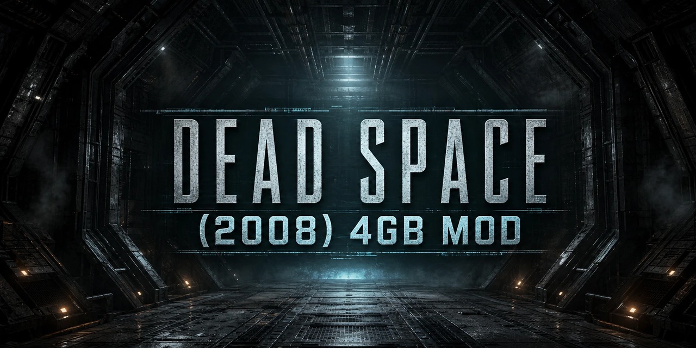

<p align="center">
  
</p>

# Dead Space (2008) 4GB Mod


-c41e1f)

**A standalone Large Address Aware mod for the original Dead Space (2008) on PC.**
Dead Space (2008) is a 32-bit game limited to 2 GB of memory, which can cause
crashes with high-resolution textures and long sessions. This mod applies the
4GB patch through a lightweight `dsound.dll` proxy that forwards all
DirectSound exports untouched — no patcher to run. On the first launch with an
unpatched executable, the proxy flips the Large Address Aware bit in
`Dead Space.exe` itself (one bit; a SHA-256-verified backup and manifest are
written beside it), then the game restarts itself once.

## What it does

- Enables the Large Address Aware flag so `Dead Space.exe` can use up to 4 GB
  of virtual memory on 64-bit Windows.
- Ships as an unsigned, uncompressed, unobfuscated 32-bit `dsound.dll` proxy
  that forwards every DirectSound export to the real system DLL.
- Includes `Restore.cmd` to revert cleanly.

## Install

1. Copy `dsound.dll` from the release ZIP beside `Dead Space.exe`.
2. Launch the game normally. On an unpatched executable the game closes and
   reopens itself once while the patch is applied; later launches need no
   restart.
3. To uninstall: with the game closed and `dsound.dll` still in place, run
   `Restore.cmd` and wait for its verified SUCCESS message — this restores the
   original executable. Only then remove the mod's `dsound.dll`. Removing the
   DLL first while leaving the executable patched can bring back the Steam
   application load error; Steam's Verify Integrity can restore the store
   executable if that happens.

See `README.txt` for the full player installation guide.

## Build from source

On Windows 10 or 11 with the Visual Studio 2022 C++ x86 build tools and
PowerShell, run:

```powershell
.\build-and-test.ps1
```

This builds `build\dsound.dll` and runs the synthetic patch, restore, and
Steam compatibility checks. [`SOURCE_README.md`](SOURCE_README.md) describes
the source package and test coverage. The root files match the 1.1.2 source
checksum manifest.

## Preserved versions

| Version | Original install ZIP | Original source ZIP | Original checksum record |
| --- | --- | --- | --- |
| 1.1.0 | Yes | Yes, with a browsable extracted snapshot | `RELEASE_CHECKSUMS_v1.1.0.txt` |
| 1.1.1 | Yes | No separate source archive found locally | No original checksum file found; a clearly marked checksum was generated for this backup |
| 1.1.2 | Yes | Yes | Two original `.sha256` sidecars |

The 1.1.1 ZIP contains the same `dsound.dll` bytes as 1.1.0; its package
removes developer-facing files and updates the player documentation. The
original release archives and checksum records remain unchanged.
[`versions/README.md`](versions/README.md) describes each archived file and
the gaps. No historical Git tags have been fabricated.

This repository does not contain a copy of `Dead Space.exe` or NTCore's
patcher.

## Credits and licensing

Created by Rama2120.

The mod's source is under the MIT License in [`LICENSE.txt`](LICENSE.txt).
Bundled MinHook source has its own license in
[`vendor/minhook-1.3.4/LICENSE.txt`](vendor/minhook-1.3.4/LICENSE.txt).
